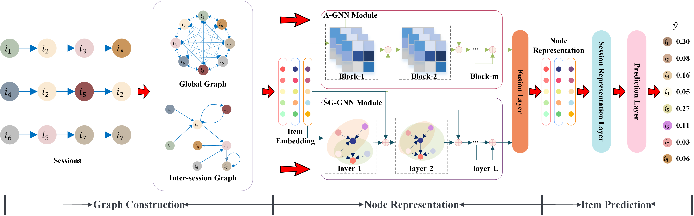

# DGNN-for-Session-based-Recommendation

This is a Pytorch implementation for our WSDM 2023 paper:

> Zihao Li, Xianzhi Wang, Chao Yang, Lina Yao, Julian McAuley, Guandong Xu. 2023. Exploiting Explicit and Implicit Item relationships for Session-based Recommendation. In Proceedings of the Sixteenth ACM International Conference on Web Search and Data Mining (WSDM '23).

Contributors: Zihao Li.

## Overview

We propose to decouple the modeling of explicit dependencies and implicit correlations among items for session-based recommendation.
To this end, we present a dual graph neural network (DGNN), where a GNN with a single gate (SG-GNN) captures the explicit dependencies as reflected by the ordering of items in sessions, and an adaptive GNN (A-GNN) learns implicit correlations between any two items adaptively with a self-learning strategy. Our model works as below,



## Environment Requirement

- Install Python, Pytorch(>=1.8). Our code has been tested running under a Linux desktop (NVIDIA Quadro RTX 6000), Python 3.6.8, Pytorch 1.10.1.  

## Datasets

The preprocessed datasets are included in the repo (e.g. datasets/lastfm/train.txt), where each line contains a session id and item id list (starting from 1) meaning the interactions (sorted by timestamp).

The data pre-processing script (i.e., preprocess_Dig_Yoo) is also included. For example, You can also download the raw Yoochoose-click data from [here](https://www.kaggle.com/datasets/chadgostopp/recsys-challenge-2015?select=yoochoose-clicks.dat) and run preprocess_Dig_Yoo.py to obtatin the preprocessed dataset for model training.

## Quick Start

Download this repository and run the below command on the terminal for model training.

```
python code/main.py --dataset diginetica
```

Output log :

```
2022/11/22 21:34:22 - __main__ - INFO - 55 - main - Namespace(batchSize=100, dataset='diginetica', dropout_global_att=0.5, dropout_global_ffn=0.5, epoch=50, fuse_A=False, global_att_block_nums=5, global_att_head_nums=4, hiddenSize=100, l2=1e-05, len_max=70, log_file='log/', lr=0.001, lr_dc=0.5, lr_dc_step=3, mt=0.9, nonhybrid=False, patience=5, random_seed=2023, step_global=2, valid_portion=0.1, validation=False)
2022/11/22 21:34:42 - __main__ - INFO - 122 - main - -------------------------------------------------------
2022/11/22 21:34:42 - __main__ - INFO - 124 - main - epoch: 0
2022/11/22 21:34:42 - __main__ - INFO - 201 - model - start training:2022-11-22 21:34:42.345332
2022/11/22 21:34:44 - __main__ - INFO - 218 - model - [0/7195] Loss: 10.6660
2022/11/22 21:42:26 - __main__ - INFO - 218 - model - [1440/7195] Loss: 7.3387
2022/11/22 21:50:09 - __main__ - INFO - 218 - model - [2880/7195] Loss: 6.4663
2022/11/22 21:58:06 - __main__ - INFO - 218 - model - [4320/7195] Loss: 16375.8408
2022/11/22 22:06:01 - __main__ - INFO - 218 - model - [5760/7195] Loss: 2630.1531
2022/11/22 22:13:46 - __main__ - INFO - 220 - model - 	Loss:	90609528.000
2022/11/22 22:13:46 - __main__ - INFO - 222 - model - start predicting: 2022-11-22 22:13:46.646646
2022/11/22 22:14:42 - __main__ - INFO - 140 - main - Best Result:
2022/11/22 22:14:42 - __main__ - INFO - 141 - main - 	Recall@20:	3.8401	MMR@20:	1.0511	Epoch:	0,	0
2022/11/22 22:14:42 - __main__ - INFO - 122 - main - -------------------------------------------------------
2022/11/22 22:14:42 - __main__ - INFO - 124 - main - epoch: 1
2022/11/22 22:14:42 - __main__ - INFO - 201 - model - start training:2022-11-22 22:14:42.591491
2022/11/22 22:14:43 - __main__ - INFO - 218 - model - [0/7195] Loss: 2965.4319
2022/11/22 22:22:30 - __main__ - INFO - 218 - model - [1440/7195] Loss: 374.3809
2022/11/22 22:30:22 - __main__ - INFO - 218 - model - [2880/7195] Loss: 200.5794
2022/11/22 22:38:19 - __main__ - INFO - 218 - model - [4320/7195] Loss: 309.3326
2022/11/22 22:46:10 - __main__ - INFO - 218 - model - [5760/7195] Loss: 11158.1699
2022/11/22 22:53:52 - __main__ - INFO - 220 - model - 	Loss:	16942378.000
2022/11/22 22:53:52 - __main__ - INFO - 222 - model - start predicting: 2022-11-22 22:53:52.855097
2022/11/22 22:54:47 - __main__ - INFO - 140 - main - Best Result:
2022/11/22 22:54:47 - __main__ - INFO - 141 - main - 	Recall@20:	7.1281	MMR@20:	2.6659	Epoch:	1,	1
2022/11/22 22:54:47 - __main__ - INFO - 122 - main - -------------------------------------------------------
2022/11/22 22:54:47 - __main__ - INFO - 124 - main - epoch: 2
2022/11/22 22:54:47 - __main__ - INFO - 201 - model - start training:2022-11-22 22:54:47.985698
2022/11/22 22:54:48 - __main__ - INFO - 218 - model - [0/7195] Loss: 221.9447
2022/11/22 23:02:20 - __main__ - INFO - 218 - model - [1440/7195] Loss: 133.7093
2022/11/22 23:09:54 - __main__ - INFO - 218 - model - [2880/7195] Loss: 66.1642
2022/11/22 23:17:27 - __main__ - INFO - 218 - model - [4320/7195] Loss: 465.2521
2022/11/22 23:25:02 - __main__ - INFO - 218 - model - [5760/7195] Loss: 128.3305
2022/11/22 23:32:33 - __main__ - INFO - 220 - model - 	Loss:	2221822.500
2022/11/22 23:32:33 - __main__ - INFO - 222 - model - start predicting: 2022-11-22 23:32:33.347848
2022/11/22 23:33:27 - __main__ - INFO - 140 - main - Best Result:
2022/11/22 23:33:27 - __main__ - INFO - 141 - main - 	Recall@20:	13.0106	MMR@20:	5.6054	Epoch:	2,	2
2022/11/22 23:33:27 - __main__ - INFO - 122 - main - -------------------------------------------------------
2022/11/22 23:33:27 - __main__ - INFO - 124 - main - epoch: 3
2022/11/22 23:33:27 - __main__ - INFO - 201 - model - start training:2022-11-22 23:33:27.128650
2022/11/22 23:33:27 - __main__ - INFO - 218 - model - [0/7195] Loss: 29.7518
2022/11/22 23:41:01 - __main__ - INFO - 218 - model - [1440/7195] Loss: 60.8124
2022/11/22 23:48:34 - __main__ - INFO - 218 - model - [2880/7195] Loss: 8.4563
2022/11/22 23:56:09 - __main__ - INFO - 218 - model - [4320/7195] Loss: 10.2007
2022/11/23 00:03:44 - __main__ - INFO - 218 - model - [5760/7195] Loss: 12.1773
2022/11/23 00:11:17 - __main__ - INFO - 220 - model - 	Loss:	163452.281
2022/11/23 00:11:17 - __main__ - INFO - 222 - model - start predicting: 2022-11-23 00:11:17.322086
2022/11/23 00:12:10 - __main__ - INFO - 140 - main - Best Result:
2022/11/23 00:12:10 - __main__ - INFO - 141 - main - 	Recall@20:	30.2524	MMR@20:	16.7527	Epoch:	3,	3
2022/11/23 00:12:10 - __main__ - INFO - 122 - main - -------------------------------------------------------
2022/11/23 00:12:10 - __main__ - INFO - 124 - main - epoch: 4
2022/11/23 00:12:10 - __main__ - INFO - 201 - model - start training:2022-11-23 00:12:10.786142
2022/11/23 00:12:11 - __main__ - INFO - 218 - model - [0/7195] Loss: 8.8338
2022/11/23 00:19:44 - __main__ - INFO - 218 - model - [1440/7195] Loss: 6.4273
2022/11/23 00:27:18 - __main__ - INFO - 218 - model - [2880/7195] Loss: 11.5921
2022/11/23 00:34:53 - __main__ - INFO - 218 - model - [4320/7195] Loss: 6.5608
2022/11/23 00:42:28 - __main__ - INFO - 218 - model - [5760/7195] Loss: 5.8333
2022/11/23 00:49:59 - __main__ - INFO - 220 - model - 	Loss:	83056.594
2022/11/23 00:49:59 - __main__ - INFO - 222 - model - start predicting: 2022-11-23 00:49:59.671330
2022/11/23 00:50:53 - __main__ - INFO - 140 - main - Best Result:
2022/11/23 00:50:53 - __main__ - INFO - 141 - main - 	Recall@20:	49.3526	MMR@20:	29.8486	Epoch:	4,	4
2022/11/23 00:50:53 - __main__ - INFO - 122 - main - -------------------------------------------------------
2022/11/23 00:50:53 - __main__ - INFO - 124 - main - epoch: 5
2022/11/23 00:50:53 - __main__ - INFO - 201 - model - start training:2022-11-23 00:50:53.763321
2022/11/23 00:50:54 - __main__ - INFO - 218 - model - [0/7195] Loss: 7.2795
2022/11/23 00:58:27 - __main__ - INFO - 218 - model - [1440/7195] Loss: 4.4977
2022/11/23 01:06:01 - __main__ - INFO - 218 - model - [2880/7195] Loss: 4.1421
2022/11/23 01:13:40 - __main__ - INFO - 218 - model - [4320/7195] Loss: 4.8141
2022/11/23 01:21:18 - __main__ - INFO - 218 - model - [5760/7195] Loss: 4.2773
2022/11/23 01:28:53 - __main__ - INFO - 220 - model - 	Loss:	36082.113
2022/11/23 01:28:53 - __main__ - INFO - 222 - model - start predicting: 2022-11-23 01:28:53.159532
2022/11/23 01:29:47 - __main__ - INFO - 140 - main - Best Result:
2022/11/23 01:29:47 - __main__ - INFO - 141 - main - 	Recall@20:	63.6087	MMR@20:	40.1149	Epoch:	5,	5
2022/11/23 01:29:47 - __main__ - INFO - 122 - main - -------------------------------------------------------
2022/11/23 01:29:47 - __main__ - INFO - 124 - main - epoch: 6
2022/11/23 01:29:47 - __main__ - INFO - 201 - model - start training:2022-11-23 01:29:47.813213
2022/11/23 01:29:48 - __main__ - INFO - 218 - model - [0/7195] Loss: 5.8456
2022/11/23 01:37:24 - __main__ - INFO - 218 - model - [1440/7195] Loss: 3.0819
2022/11/23 01:45:00 - __main__ - INFO - 218 - model - [2880/7195] Loss: 3.5741
2022/11/23 01:52:37 - __main__ - INFO - 218 - model - [4320/7195] Loss: 4.0256
2022/11/23 02:00:14 - __main__ - INFO - 218 - model - [5760/7195] Loss: 3.5789
2022/11/23 02:07:49 - __main__ - INFO - 220 - model - 	Loss:	28449.498
2022/11/23 02:07:49 - __main__ - INFO - 222 - model - start predicting: 2022-11-23 02:07:49.419066
2022/11/23 02:08:44 - __main__ - INFO - 140 - main - Best Result:
2022/11/23 02:08:44 - __main__ - INFO - 141 - main - 	Recall@20:	70.2619	MMR@20:	45.5707	Epoch:	6,	6
2022/11/23 02:08:44 - __main__ - INFO - 122 - main - -------------------------------------------------------
2022/11/23 02:08:44 - __main__ - INFO - 124 - main - epoch: 7
2022/11/23 02:08:44 - __main__ - INFO - 201 - model - start training:2022-11-23 02:08:44.613069
2022/11/23 02:08:45 - __main__ - INFO - 218 - model - [0/7195] Loss: 4.8300
2022/11/23 02:16:20 - __main__ - INFO - 218 - model - [1440/7195] Loss: 2.7946
2022/11/23 02:23:56 - __main__ - INFO - 218 - model - [2880/7195] Loss: 3.2372
2022/11/23 02:31:33 - __main__ - INFO - 218 - model - [4320/7195] Loss: 3.4812
2022/11/23 02:39:10 - __main__ - INFO - 218 - model - [5760/7195] Loss: 3.0879
2022/11/23 02:46:45 - __main__ - INFO - 220 - model - 	Loss:	24688.355
2022/11/23 02:46:45 - __main__ - INFO - 222 - model - start predicting: 2022-11-23 02:46:45.132232
2022/11/23 02:47:39 - __main__ - INFO - 140 - main - Best Result:
2022/11/23 02:47:39 - __main__ - INFO - 141 - main - 	Recall@20:	72.8992	MMR@20:	48.3469	Epoch:	7,	7
2022/11/23 02:47:39 - __main__ - INFO - 122 - main - -------------------------------------------------------
2022/11/23 02:47:39 - __main__ - INFO - 124 - main - epoch: 8
2022/11/23 02:47:39 - __main__ - INFO - 201 - model - start training:2022-11-23 02:47:39.646511
2022/11/23 02:47:40 - __main__ - INFO - 218 - model - [0/7195] Loss: 4.2298
2022/11/23 02:55:15 - __main__ - INFO - 218 - model - [1440/7195] Loss: 2.4511
2022/11/23 03:02:51 - __main__ - INFO - 218 - model - [2880/7195] Loss: 2.7870
2022/11/23 03:10:34 - __main__ - INFO - 218 - model - [4320/7195] Loss: 2.9854
2022/11/23 03:18:12 - __main__ - INFO - 218 - model - [5760/7195] Loss: 2.5760
2022/11/23 03:25:46 - __main__ - INFO - 220 - model - 	Loss:	20657.387
2022/11/23 03:25:46 - __main__ - INFO - 222 - model - start predicting: 2022-11-23 03:25:46.649939
2022/11/23 03:26:41 - __main__ - INFO - 140 - main - Best Result:
2022/11/23 03:26:41 - __main__ - INFO - 141 - main - 	Recall@20:	74.1037	MMR@20:	50.5254	Epoch:	8,	8
2022/11/23 03:26:41 - __main__ - INFO - 122 - main - -------------------------------------------------------
2022/11/23 03:26:41 - __main__ - INFO - 124 - main - epoch: 9
2022/11/23 03:26:41 - __main__ - INFO - 201 - model - start training:2022-11-23 03:26:41.472425
2022/11/23 03:26:42 - __main__ - INFO - 218 - model - [0/7195] Loss: 3.6888
2022/11/23 03:34:18 - __main__ - INFO - 218 - model - [1440/7195] Loss: 2.3910
2022/11/23 03:41:54 - __main__ - INFO - 218 - model - [2880/7195] Loss: 2.6611
2022/11/23 03:49:30 - __main__ - INFO - 218 - model - [4320/7195] Loss: 2.8552
2022/11/23 03:57:08 - __main__ - INFO - 218 - model - [5760/7195] Loss: 2.4494
2022/11/23 04:04:42 - __main__ - INFO - 220 - model - 	Loss:	19511.369
2022/11/23 04:04:42 - __main__ - INFO - 222 - model - start predicting: 2022-11-23 04:04:42.493305
2022/11/23 04:05:37 - __main__ - INFO - 140 - main - Best Result:
2022/11/23 04:05:37 - __main__ - INFO - 141 - main - 	Recall@20:	74.2318	MMR@20:	50.8759	Epoch:	9,	9
2022/11/23 04:05:37 - __main__ - INFO - 122 - main - -------------------------------------------------------
2022/11/23 04:05:37 - __main__ - INFO - 124 - main - epoch: 10
2022/11/23 04:05:37 - __main__ - INFO - 201 - model - start training:2022-11-23 04:05:37.333845
2022/11/23 04:05:37 - __main__ - INFO - 218 - model - [0/7195] Loss: 3.4434
2022/11/23 04:13:12 - __main__ - INFO - 218 - model - [1440/7195] Loss: 2.2990
2022/11/23 04:20:49 - __main__ - INFO - 218 - model - [2880/7195] Loss: 2.5953
2022/11/23 04:28:26 - __main__ - INFO - 218 - model - [4320/7195] Loss: 2.7389
2022/11/23 04:36:04 - __main__ - INFO - 218 - model - [5760/7195] Loss: 2.3691
2022/11/23 04:43:39 - __main__ - INFO - 220 - model - 	Loss:	18723.820
2022/11/23 04:43:39 - __main__ - INFO - 222 - model - start predicting: 2022-11-23 04:43:39.121198
2022/11/23 04:44:33 - __main__ - INFO - 140 - main - Best Result:
2022/11/23 04:44:33 - __main__ - INFO - 141 - main - 	Recall@20:	74.2318	MMR@20:	50.9794	Epoch:	9,	10
2022/11/23 04:44:33 - __main__ - INFO - 122 - main - -------------------------------------------------------
2022/11/23 04:44:33 - __main__ - INFO - 124 - main - epoch: 11
2022/11/23 04:44:33 - __main__ - INFO - 201 - model - start training:2022-11-23 04:44:33.753163
2022/11/23 04:44:34 - __main__ - INFO - 218 - model - [0/7195] Loss: 3.2638
2022/11/23 04:52:11 - __main__ - INFO - 218 - model - [1440/7195] Loss: 2.1237
2022/11/23 04:59:47 - __main__ - INFO - 218 - model - [2880/7195] Loss: 2.4107
2022/11/23 05:07:24 - __main__ - INFO - 218 - model - [4320/7195] Loss: 2.5328
2022/11/23 05:15:01 - __main__ - INFO - 218 - model - [5760/7195] Loss: 2.0511
2022/11/23 05:22:36 - __main__ - INFO - 220 - model - 	Loss:	17069.988
2022/11/23 05:22:36 - __main__ - INFO - 222 - model - start predicting: 2022-11-23 05:22:36.674739
2022/11/23 05:23:31 - __main__ - INFO - 140 - main - Best Result:
2022/11/23 05:23:31 - __main__ - INFO - 141 - main - 	Recall@20:	74.4224	MMR@20:	51.7434	Epoch:	11,	11
2022/11/23 05:23:31 - __main__ - INFO - 122 - main - -------------------------------------------------------
2022/11/23 05:23:31 - __main__ - INFO - 124 - main - epoch: 12
2022/11/23 05:23:31 - __main__ - INFO - 201 - model - start training:2022-11-23 05:23:31.632454
2022/11/23 05:23:32 - __main__ - INFO - 218 - model - [0/7195] Loss: 2.9552
2022/11/23 05:31:08 - __main__ - INFO - 218 - model - [1440/7195] Loss: 2.0333
2022/11/23 05:38:44 - __main__ - INFO - 218 - model - [2880/7195] Loss: 2.3585
2022/11/23 05:46:21 - __main__ - INFO - 218 - model - [4320/7195] Loss: 2.4624
2022/11/23 05:54:00 - __main__ - INFO - 218 - model - [5760/7195] Loss: 2.0268
2022/11/23 06:01:35 - __main__ - INFO - 220 - model - 	Loss:	16595.393
2022/11/23 06:01:35 - __main__ - INFO - 222 - model - start predicting: 2022-11-23 06:01:35.728580
2022/11/23 06:02:30 - __main__ - INFO - 140 - main - Best Result:
2022/11/23 06:02:30 - __main__ - INFO - 141 - main - 	Recall@20:	74.4224	MMR@20:	51.7434	Epoch:	11,	11
2022/11/23 06:02:30 - __main__ - INFO - 122 - main - -------------------------------------------------------
2022/11/23 06:02:30 - __main__ - INFO - 124 - main - epoch: 13
2022/11/23 06:02:30 - __main__ - INFO - 201 - model - start training:2022-11-23 06:02:30.727060
2022/11/23 06:02:31 - __main__ - INFO - 218 - model - [0/7195] Loss: 2.8275
2022/11/23 06:10:07 - __main__ - INFO - 218 - model - [1440/7195] Loss: 1.9795
2022/11/23 06:17:42 - __main__ - INFO - 218 - model - [2880/7195] Loss: 2.3305
2022/11/23 06:25:23 - __main__ - INFO - 218 - model - [4320/7195] Loss: 2.3988
2022/11/23 06:33:00 - __main__ - INFO - 218 - model - [5760/7195] Loss: 2.0016
2022/11/23 06:40:34 - __main__ - INFO - 220 - model - 	Loss:	16250.830
2022/11/23 06:40:34 - __main__ - INFO - 222 - model - start predicting: 2022-11-23 06:40:34.972358
2022/11/23 06:41:29 - __main__ - INFO - 140 - main - Best Result:
2022/11/23 06:41:29 - __main__ - INFO - 141 - main - 	Recall@20:	74.4224	MMR@20:	51.7434	Epoch:	11,	11
2022/11/23 06:41:29 - __main__ - INFO - 122 - main - -------------------------------------------------------
2022/11/23 06:41:29 - __main__ - INFO - 124 - main - epoch: 14
2022/11/23 06:41:29 - __main__ - INFO - 201 - model - start training:2022-11-23 06:41:29.802978
2022/11/23 06:41:30 - __main__ - INFO - 218 - model - [0/7195] Loss: 2.7368
2022/11/23 06:49:06 - __main__ - INFO - 218 - model - [1440/7195] Loss: 1.8645
2022/11/23 06:56:42 - __main__ - INFO - 218 - model - [2880/7195] Loss: 2.2262
2022/11/23 07:04:19 - __main__ - INFO - 218 - model - [4320/7195] Loss: 2.3247
2022/11/23 07:11:57 - __main__ - INFO - 218 - model - [5760/7195] Loss: 1.8570
2022/11/23 07:19:31 - __main__ - INFO - 220 - model - 	Loss:	15416.592
2022/11/23 07:19:31 - __main__ - INFO - 222 - model - start predicting: 2022-11-23 07:19:31.839298
2022/11/23 07:20:26 - __main__ - INFO - 140 - main - Best Result:
2022/11/23 07:20:26 - __main__ - INFO - 141 - main - 	Recall@20:	74.4224	MMR@20:	51.9562	Epoch:	11,	14
2022/11/23 07:20:26 - __main__ - INFO - 122 - main - -------------------------------------------------------
2022/11/23 07:20:26 - __main__ - INFO - 124 - main - epoch: 15
2022/11/23 07:20:26 - __main__ - INFO - 201 - model - start training:2022-11-23 07:20:26.425883
2022/11/23 07:20:26 - __main__ - INFO - 218 - model - [0/7195] Loss: 2.5805
2022/11/23 07:28:02 - __main__ - INFO - 218 - model - [1440/7195] Loss: 1.8330
2022/11/23 07:35:38 - __main__ - INFO - 218 - model - [2880/7195] Loss: 2.2042
2022/11/23 07:43:15 - __main__ - INFO - 218 - model - [4320/7195] Loss: 2.2843
2022/11/23 07:50:53 - __main__ - INFO - 218 - model - [5760/7195] Loss: 1.8406
2022/11/23 07:58:28 - __main__ - INFO - 220 - model - 	Loss:	15163.688
2022/11/23 07:58:28 - __main__ - INFO - 222 - model - start predicting: 2022-11-23 07:58:28.334356
2022/11/23 07:59:23 - __main__ - INFO - 140 - main - Best Result:
2022/11/23 07:59:23 - __main__ - INFO - 141 - main - 	Recall@20:	74.4224	MMR@20:	51.9562	Epoch:	11,	14
2022/11/23 07:59:23 - __main__ - INFO - 122 - main - -------------------------------------------------------
2022/11/23 07:59:23 - __main__ - INFO - 124 - main - epoch: 16
2022/11/23 07:59:23 - __main__ - INFO - 201 - model - start training:2022-11-23 07:59:23.659006
2022/11/23 07:59:24 - __main__ - INFO - 218 - model - [0/7195] Loss: 2.5272
2022/11/23 08:06:59 - __main__ - INFO - 218 - model - [1440/7195] Loss: 1.7951
2022/11/23 08:14:36 - __main__ - INFO - 218 - model - [2880/7195] Loss: 2.1786
2022/11/23 08:22:13 - __main__ - INFO - 218 - model - [4320/7195] Loss: 2.2426
2022/11/23 08:29:51 - __main__ - INFO - 218 - model - [5760/7195] Loss: 1.8536
2022/11/23 08:37:26 - __main__ - INFO - 220 - model - 	Loss:	14986.437
2022/11/23 08:37:26 - __main__ - INFO - 222 - model - start predicting: 2022-11-23 08:37:26.703422
2022/11/23 08:38:21 - __main__ - INFO - 140 - main - Best Result:
2022/11/23 08:38:21 - __main__ - INFO - 141 - main - 	Recall@20:	74.4224	MMR@20:	51.9562	Epoch:	11,	14
2022/11/23 08:38:21 - __main__ - INFO - 122 - main - -------------------------------------------------------
2022/11/23 08:38:21 - __main__ - INFO - 124 - main - epoch: 17
2022/11/23 08:38:21 - __main__ - INFO - 201 - model - start training:2022-11-23 08:38:21.981485
2022/11/23 08:38:22 - __main__ - INFO - 218 - model - [0/7195] Loss: 2.4671
2022/11/23 08:45:57 - __main__ - INFO - 218 - model - [1440/7195] Loss: 1.7360
2022/11/23 08:53:34 - __main__ - INFO - 218 - model - [2880/7195] Loss: 2.1353
2022/11/23 09:01:15 - __main__ - INFO - 218 - model - [4320/7195] Loss: 2.1925
2022/11/23 09:08:55 - __main__ - INFO - 218 - model - [5760/7195] Loss: 1.7805
2022/11/23 09:16:30 - __main__ - INFO - 220 - model - 	Loss:	14556.920
2022/11/23 09:16:30 - __main__ - INFO - 222 - model - start predicting: 2022-11-23 09:16:30.491623
2022/11/23 09:17:26 - __main__ - INFO - 140 - main - Best Result:
2022/11/23 09:17:26 - __main__ - INFO - 141 - main - 	Recall@20:	74.4224	MMR@20:	52.0166	Epoch:	11,	17
2022/11/23 09:17:26 - __main__ - INFO - 122 - main - -------------------------------------------------------
2022/11/23 09:17:26 - __main__ - INFO - 124 - main - epoch: 18
2022/11/23 09:17:26 - __main__ - INFO - 201 - model - start training:2022-11-23 09:17:26.038738
2022/11/23 09:17:26 - __main__ - INFO - 218 - model - [0/7195] Loss: 2.4154
2022/11/23 09:25:02 - __main__ - INFO - 218 - model - [1440/7195] Loss: 1.7230
2022/11/23 09:32:38 - __main__ - INFO - 218 - model - [2880/7195] Loss: 2.1255
2022/11/23 09:40:15 - __main__ - INFO - 218 - model - [4320/7195] Loss: 2.1770
2022/11/23 09:47:58 - __main__ - INFO - 218 - model - [5760/7195] Loss: 1.7601
2022/11/23 09:56:14 - __main__ - INFO - 220 - model - 	Loss:	14414.090
2022/11/23 09:56:14 - __main__ - INFO - 222 - model - start predicting: 2022-11-23 09:56:14.124822
2022/11/23 09:57:13 - __main__ - INFO - 140 - main - Best Result:
2022/11/23 09:57:13 - __main__ - INFO - 141 - main - 	Recall@20:	74.4224	MMR@20:	52.0166	Epoch:	11,	17
2022/11/23 09:57:13 - __main__ - INFO - 122 - main - -------------------------------------------------------
2022/11/23 09:57:13 - __main__ - INFO - 124 - main - epoch: 19
2022/11/23 09:57:13 - __main__ - INFO - 201 - model - start training:2022-11-23 09:57:13.306561
2022/11/23 09:57:13 - __main__ - INFO - 218 - model - [0/7195] Loss: 2.3652
2022/11/23 10:05:28 - __main__ - INFO - 218 - model - [1440/7195] Loss: 1.7137
2022/11/23 10:13:17 - __main__ - INFO - 218 - model - [2880/7195] Loss: 2.1148
2022/11/23 10:21:08 - __main__ - INFO - 218 - model - [4320/7195] Loss: 2.1584
2022/11/23 10:28:59 - __main__ - INFO - 218 - model - [5760/7195] Loss: 1.7683
2022/11/23 10:36:47 - __main__ - INFO - 220 - model - 	Loss:	14319.896
2022/11/23 10:36:47 - __main__ - INFO - 222 - model - start predicting: 2022-11-23 10:36:47.754429
2022/11/23 10:37:45 - __main__ - INFO - 140 - main - Best Result:
2022/11/23 10:37:45 - __main__ - INFO - 141 - main - 	Recall@20:	74.4224	MMR@20:	52.0166	Epoch:	11,	17
2022/11/23 10:37:45 - __main__ - INFO - 122 - main - -------------------------------------------------------
2022/11/23 10:37:45 - __main__ - INFO - 124 - main - epoch: 20
2022/11/23 10:37:45 - __main__ - INFO - 201 - model - start training:2022-11-23 10:37:45.062179
2022/11/23 10:37:45 - __main__ - INFO - 218 - model - [0/7195] Loss: 2.3462
2022/11/23 10:45:34 - __main__ - INFO - 218 - model - [1440/7195] Loss: 1.6716
2022/11/23 10:53:24 - __main__ - INFO - 218 - model - [2880/7195] Loss: 2.0814
2022/11/23 11:01:07 - __main__ - INFO - 218 - model - [4320/7195] Loss: 2.1283
2022/11/23 11:09:02 - __main__ - INFO - 218 - model - [5760/7195] Loss: 1.7270
2022/11/23 11:16:49 - __main__ - INFO - 220 - model - 	Loss:	14100.801
2022/11/23 11:16:49 - __main__ - INFO - 222 - model - start predicting: 2022-11-23 11:16:49.391504
2022/11/23 11:17:47 - __main__ - INFO - 140 - main - Best Result:
2022/11/23 11:17:47 - __main__ - INFO - 141 - main - 	Recall@20:	74.4224	MMR@20:	52.1028	Epoch:	11,	20
2022/11/23 11:17:47 - __main__ - INFO - 122 - main - -------------------------------------------------------
2022/11/23 11:17:47 - __main__ - INFO - 124 - main - epoch: 21
2022/11/23 11:17:47 - __main__ - INFO - 201 - model - start training:2022-11-23 11:17:47.646748
2022/11/23 11:17:48 - __main__ - INFO - 218 - model - [0/7195] Loss: 2.3238
2022/11/23 11:25:37 - __main__ - INFO - 218 - model - [1440/7195] Loss: 1.6784
2022/11/23 11:33:37 - __main__ - INFO - 218 - model - [2880/7195] Loss: 2.0784
2022/11/23 11:41:33 - __main__ - INFO - 218 - model - [4320/7195] Loss: 2.1195
2022/11/23 11:49:30 - __main__ - INFO - 218 - model - [5760/7195] Loss: 1.7281
2022/11/23 11:57:23 - __main__ - INFO - 220 - model - 	Loss:	14020.557
2022/11/23 11:57:23 - __main__ - INFO - 222 - model - start predicting: 2022-11-23 11:57:23.181603
2022/11/23 11:58:21 - __main__ - INFO - 140 - main - Best Result:
2022/11/23 11:58:21 - __main__ - INFO - 141 - main - 	Recall@20:	74.4224	MMR@20:	52.1028	Epoch:	11,	20
2022/11/23 11:58:21 - __main__ - INFO - 122 - main - -------------------------------------------------------
2022/11/23 11:58:21 - __main__ - INFO - 124 - main - epoch: 22
2022/11/23 11:58:21 - __main__ - INFO - 201 - model - start training:2022-11-23 11:58:21.841935
2022/11/23 11:58:22 - __main__ - INFO - 218 - model - [0/7195] Loss: 2.2961
2022/11/23 12:06:08 - __main__ - INFO - 218 - model - [1440/7195] Loss: 1.6548
2022/11/23 12:13:53 - __main__ - INFO - 218 - model - [2880/7195] Loss: 2.0749
2022/11/23 12:21:38 - __main__ - INFO - 218 - model - [4320/7195] Loss: 2.1159
2022/11/23 12:29:24 - __main__ - INFO - 218 - model - [5760/7195] Loss: 1.7330
2022/11/23 12:37:07 - __main__ - INFO - 220 - model - 	Loss:	13969.886
2022/11/23 12:37:07 - __main__ - INFO - 222 - model - start predicting: 2022-11-23 12:37:07.141681
2022/11/23 12:38:06 - __main__ - INFO - 140 - main - Best Result:
2022/11/23 12:38:06 - __main__ - INFO - 141 - main - 	Recall@20:	74.4224	MMR@20:	52.1028	Epoch:	11,	20
2022/11/23 12:38:06 - __main__ - INFO - 122 - main - -------------------------------------------------------
2022/11/23 12:38:06 - __main__ - INFO - 124 - main - epoch: 23
2022/11/23 12:38:06 - __main__ - INFO - 201 - model - start training:2022-11-23 12:38:06.096057
2022/11/23 12:38:06 - __main__ - INFO - 218 - model - [0/7195] Loss: 2.2918
2022/11/23 12:45:48 - __main__ - INFO - 218 - model - [1440/7195] Loss: 1.6612
2022/11/23 12:53:31 - __main__ - INFO - 218 - model - [2880/7195] Loss: 2.0721
2022/11/23 13:01:13 - __main__ - INFO - 218 - model - [4320/7195] Loss: 2.0969
2022/11/23 13:08:56 - __main__ - INFO - 218 - model - [5760/7195] Loss: 1.6971
2022/11/23 13:16:36 - __main__ - INFO - 220 - model - 	Loss:	13863.137
2022/11/23 13:16:36 - __main__ - INFO - 222 - model - start predicting: 2022-11-23 13:16:36.475819
2022/11/23 13:17:33 - __main__ - INFO - 140 - main - Best Result:
2022/11/23 13:17:33 - __main__ - INFO - 141 - main - 	Recall@20:	74.4224	MMR@20:	52.1028	Epoch:	11,	20
2022/11/23 13:17:33 - __main__ - INFO - 122 - main - -------------------------------------------------------
2022/11/23 13:17:33 - __main__ - INFO - 124 - main - epoch: 24
2022/11/23 13:17:33 - __main__ - INFO - 201 - model - start training:2022-11-23 13:17:33.143880
2022/11/23 13:17:33 - __main__ - INFO - 218 - model - [0/7195] Loss: 2.2823
2022/11/23 13:25:13 - __main__ - INFO - 218 - model - [1440/7195] Loss: 1.6485
2022/11/23 13:32:54 - __main__ - INFO - 218 - model - [2880/7195] Loss: 2.0688
2022/11/23 13:40:36 - __main__ - INFO - 218 - model - [4320/7195] Loss: 2.0849
2022/11/23 13:48:19 - __main__ - INFO - 218 - model - [5760/7195] Loss: 1.7127
2022/11/23 13:56:00 - __main__ - INFO - 220 - model - 	Loss:	13817.807
2022/11/23 13:56:00 - __main__ - INFO - 222 - model - start predicting: 2022-11-23 13:56:00.455063
2022/11/23 13:56:57 - __main__ - INFO - 140 - main - Best Result:
2022/11/23 13:56:57 - __main__ - INFO - 141 - main - 	Recall@20:	74.4224	MMR@20:	52.1028	Epoch:	11,	20
2022/11/23 13:56:57 - __main__ - INFO - 122 - main - -------------------------------------------------------
2022/11/23 13:56:57 - __main__ - INFO - 124 - main - epoch: 25
2022/11/23 13:56:57 - __main__ - INFO - 201 - model - start training:2022-11-23 13:56:57.043982
2022/11/23 13:56:57 - __main__ - INFO - 218 - model - [0/7195] Loss: 2.2688
2022/11/23 14:04:37 - __main__ - INFO - 218 - model - [1440/7195] Loss: 1.6344
2022/11/23 14:12:31 - __main__ - INFO - 218 - model - [2880/7195] Loss: 2.0483
2022/11/23 14:20:13 - __main__ - INFO - 218 - model - [4320/7195] Loss: 2.0865
2022/11/23 14:27:56 - __main__ - INFO - 218 - model - [5760/7195] Loss: 1.7065
2022/11/23 14:35:37 - __main__ - INFO - 220 - model - 	Loss:	13791.655
2022/11/23 14:35:37 - __main__ - INFO - 222 - model - start predicting: 2022-11-23 14:35:37.315811
2022/11/23 14:36:34 - __main__ - INFO - 140 - main - Best Result:
2022/11/23 14:36:34 - __main__ - INFO - 141 - main - 	Recall@20:	74.4224	MMR@20:	52.1028	Epoch:	11,	20
2022/11/23 14:36:34 - __main__ - INFO - 146 - main - -------------------------------------------------------
2022/11/23 14:36:34 - __main__ - INFO - 149 - main - Run time: 61312.220631 s
```

You can also config other experimental settsing for your requirements
```
usage: main.py [-h] [--dataset DATASET] [--random_seed RANDOM_SEED] [--len_max LEN_MAX] [--batchSize BATCHSIZE]
               [--hiddenSize HIDDENSIZE] [--fuse_A] [--global_att_block_nums GLOBAL_ATT_BLOCK_NUMS]
               [--global_att_head_nums GLOBAL_ATT_HEAD_NUMS] [--dropout_global_att DROPOUT_GLOBAL_ATT]
               [--dropout_global_ffn DROPOUT_GLOBAL_FFN] [--epoch EPOCH] [--lr LR] [--mt MT] [--lr_dc LR_DC]
               [--lr_dc_step LR_DC_STEP] [--l2 L2] [--step_global STEP_GLOBAL] [--nonhybrid] [--patience PATIENCE]
               [--validation] [--valid_portion VALID_PORTION] [--log_file LOG_FILE]

optional arguments:
  -h, --help            show this help message and exit
  --dataset DATASET     dataset name: diginetica/yoochoose1_4/yoochoose1_64/Gowalla/LastFM/sample
  --random_seed RANDOM_SEED
                        random_seed
  --len_max LEN_MAX     max lenghth of sequences
  --batchSize BATCHSIZE
                        input batch size
  --hiddenSize HIDDENSIZE
                        hidden state size
  --fuse_A              whether to fuse an auxiliary adjacent matrix via correlation or self-attention
  --global_att_block_nums GLOBAL_ATT_BLOCK_NUMS
                        the number of global attention blocks
  --global_att_head_nums GLOBAL_ATT_HEAD_NUMS
                        the number of multi-heads for global attention
  --dropout_global_att DROPOUT_GLOBAL_ATT
                        dropout of global attention
  --dropout_global_ffn DROPOUT_GLOBAL_FFN
                        dropout of ffn in global attention block
  --epoch EPOCH         the number of epochs to train for
  --lr LR               learning rate
  --mt MT               the momentum of SGD
  --lr_dc LR_DC         learning rate decay rate
  --lr_dc_step LR_DC_STEP
                        the number of steps after which the learning rate decay
  --l2 L2               l2 penalty
  --step_global STEP_GLOBAL
                        global gnn propogation steps
  --nonhybrid           only use the global preference to predict
  --patience PATIENCE   the number of epoch to wait before early stop
  --validation          validation
  --valid_portion VALID_PORTION
                        split the portion of training set as validation set
  --log_file LOG_FILE   log dir path
```

## Acknowledgement

Our code is developed based on [SR-GNN](https://github.com/CRIPAC-DIG/SR-GNN). Thanks to the authors for their contributions.
